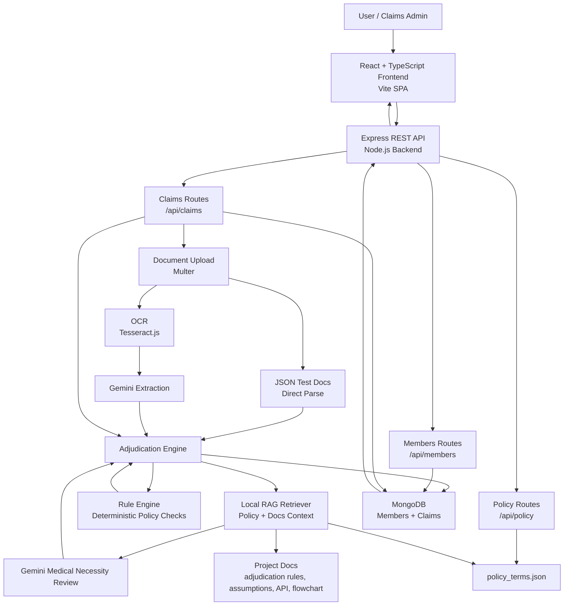

# Architecture Diagram

## System Overview

## Components

| Layer | Technology | Responsibility |
|---|---|---|
| Frontend | React, TypeScript, Vite | Claim submission wizard, dashboard, claims list, policy viewer |
| Backend | Node.js, Express | REST API, validation, claim workflow orchestration |
| Database | MongoDB, Mongoose | Stores members, claims, decisions, uploaded document metadata |
| Rules | Custom rule engine | Eligibility, documents, coverage, limits, fraud checks |
| AI | Google Gemini | Document extraction and medical necessity assessment |
| RAG | Local keyword retriever | Supplies policy/document context to Gemini prompts |
| OCR | Tesseract.js | Extracts text from uploaded image/PDF documents |
| File Uploads | Multer | Accepts image/PDF documents and JSON test documents |

## Data Flow

1. User submits a claim from the React frontend.
2. Backend receives claim metadata and optional documents.
3. If documents are JSON test files, they are parsed directly as extracted data.
4. If documents are images/PDFs, OCR extracts text and Gemini converts it to structured data.
5. Adjudication engine runs deterministic policy checks through the rule engine.
6. RAG retrieves relevant policy/docs context and passes it to Gemini for medical necessity review.
7. Final decision is saved to MongoDB with approval amount, reasons, confidence, flags, and step-by-step reasoning.
8. Frontend displays the decision and detailed adjudication trail.
