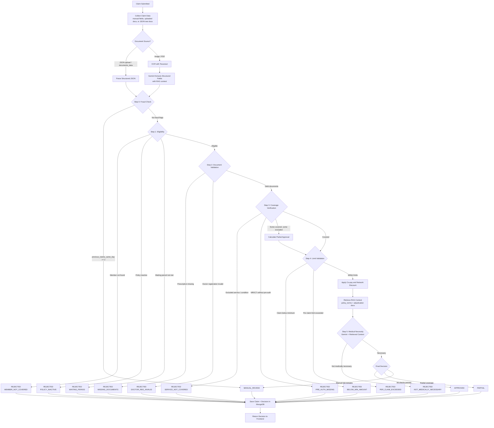

# Decision Logic Flowchart

## Decision Types

| Decision | Meaning |
|---|---|
| `APPROVED` | Claim passes all checks and is payable |
| `REJECTED` | Claim fails a hard policy or medical necessity rule |
| `PARTIAL` | Covered items are payable while excluded items are rejected |
| `MANUAL_REVIEW` | Fraud or ambiguity requires human review |
