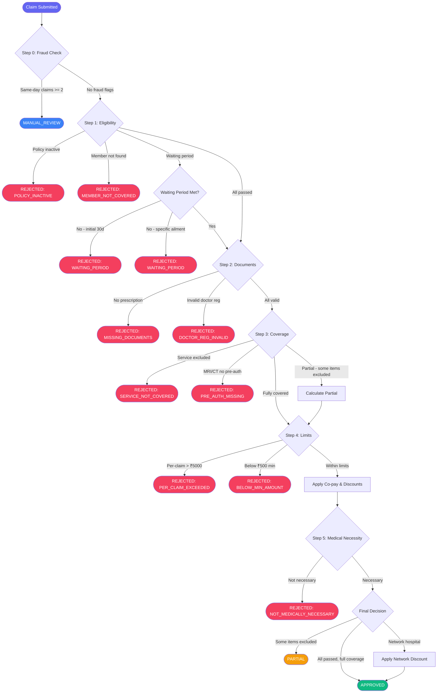

# Decision Logic Flowchart

```mermaid
flowchart TD
    Start([Claim Submitted]) --> Fraud{Step 0: Fraud Check}
    
    Fraud -->|Same-day claims >= 2| ManualReview([MANUAL_REVIEW])
    Fraud -->|No fraud flags| Eligibility{Step 1: Eligibility}
    
    Eligibility -->|Policy inactive| Reject1([REJECTED: POLICY_INACTIVE])
    Eligibility -->|Member not found| Reject2([REJECTED: MEMBER_NOT_COVERED])
    Eligibility -->|Waiting period| WaitingCheck{Waiting Period Met?}
    
    WaitingCheck -->|No - initial 30d| Reject3([REJECTED: WAITING_PERIOD])
    WaitingCheck -->|No - specific ailment| Reject4([REJECTED: WAITING_PERIOD])
    WaitingCheck -->|Yes| Documents{Step 2: Documents}
    
    Eligibility -->|All passed| Documents
    
    Documents -->|No prescription| Reject5([REJECTED: MISSING_DOCUMENTS])
    Documents -->|Invalid doctor reg| Reject6([REJECTED: DOCTOR_REG_INVALID])
    Documents -->|All valid| Coverage{Step 3: Coverage}
    
    Coverage -->|Service excluded| Reject7([REJECTED: SERVICE_NOT_COVERED])
    Coverage -->|MRI/CT no pre-auth| Reject8([REJECTED: PRE_AUTH_MISSING])
    Coverage -->|Partial - some items excluded| PartialCheck[Calculate Partial]
    Coverage -->|Fully covered| Limits{Step 4: Limits}
    
    PartialCheck --> Limits
    
    Limits -->|Per-claim > ₹5000| Reject9([REJECTED: PER_CLAIM_EXCEEDED])
    Limits -->|Below ₹500 min| Reject10([REJECTED: BELOW_MIN_AMOUNT])
    Limits -->|Within limits| CopayCalc[Apply Co-pay & Discounts]
    
    CopayCalc --> Medical{Step 5: Medical Necessity}
    
    Medical -->|Not necessary| Reject11([REJECTED: NOT_MEDICALLY_NECESSARY])
    Medical -->|Necessary| Decision{Final Decision}
    
    Decision -->|All passed, full coverage| Approved([APPROVED])
    Decision -->|Some items excluded| Partial([PARTIAL])
    Decision -->|Network hospital| Cashless[Apply Network Discount]
    
    Cashless --> Approved
    
    style Start fill:#6366f1,color:white
    style Approved fill:#10b981,color:white
    style Partial fill:#f59e0b,color:white
    style ManualReview fill:#3b82f6,color:white
    style Reject1 fill:#f43f5e,color:white
    style Reject2 fill:#f43f5e,color:white
    style Reject3 fill:#f43f5e,color:white
    style Reject4 fill:#f43f5e,color:white
    style Reject5 fill:#f43f5e,color:white
    style Reject6 fill:#f43f5e,color:white
    style Reject7 fill:#f43f5e,color:white
    style Reject8 fill:#f43f5e,color:white
    style Reject9 fill:#f43f5e,color:white
    style Reject10 fill:#f43f5e,color:white
    style Reject11 fill:#f43f5e,color:white
```
